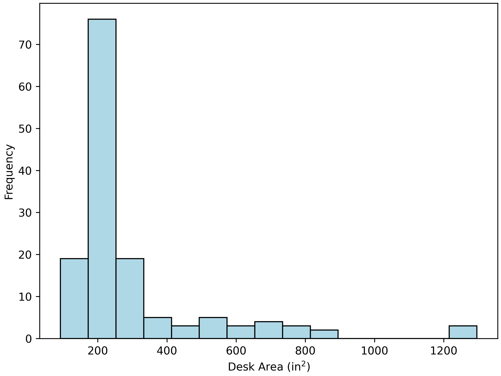
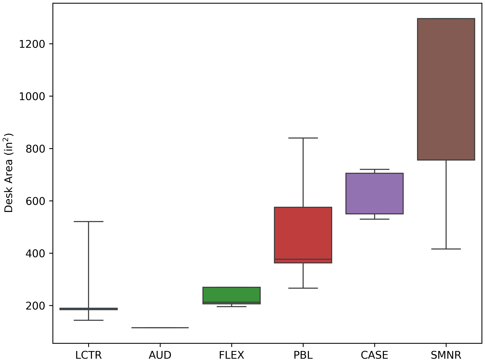
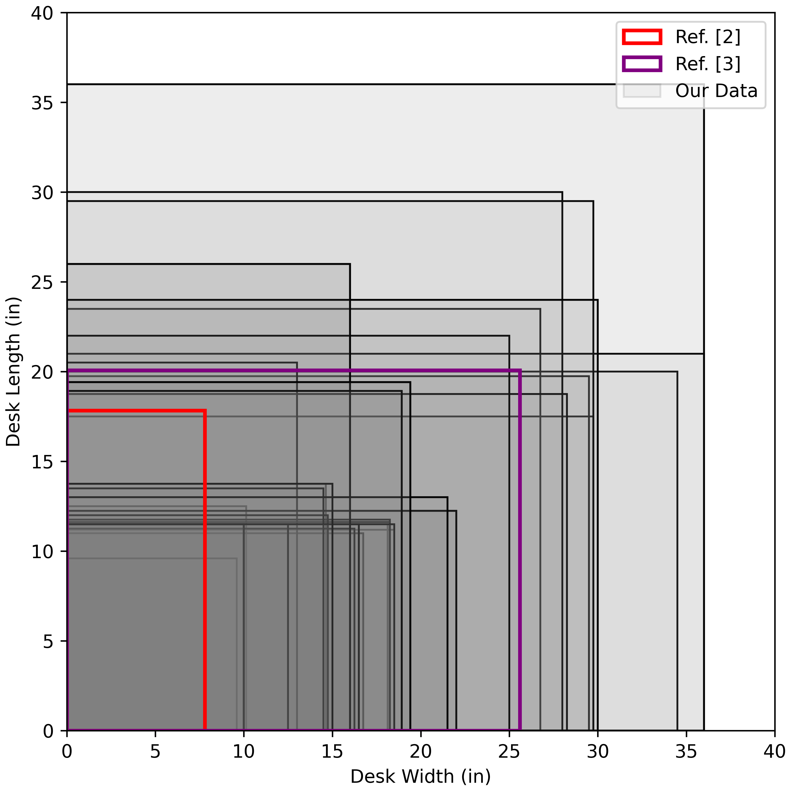
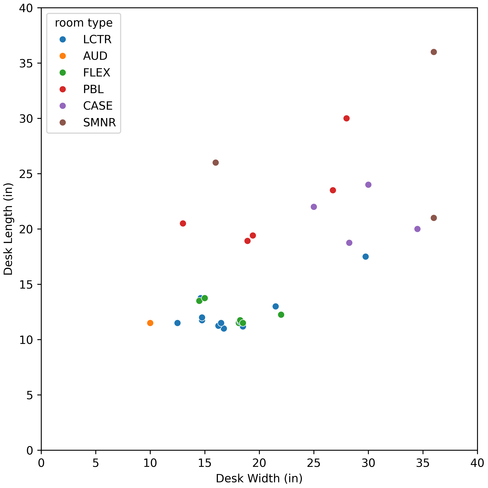

> This was a project for the honors section of UD's CHE304 "Random Variability in Chemical Processes." My main contributions to the report were the literature review, writing the introduction and discussion, and all visualization and formatting. The full report on this study is available below.

# Abstract

Classroom ergonomics impact learning and it is of interest to find out which rooms line up with ergonomic gospel (the best) and which fall short (the worst). We analyzed desk measurements across various classrooms at the University of Delaware to determine which room contained the “best” desks for students. We measured four dimensions: desk length, desk width, seat height (floor to seat), and desk height (floor to writing surface). Using room labels from UD’s Central Inventory Classrooms (CIC), we examined trends related to room type and building. The “best” desk was determined by how closely its dimensions matched values provided by classroom ergonomics literature. Using a standardized 2-norm distance metric, Colburn Lab 366 was closest to [@mohamed] and Penny Hall 209 was closest to [@Ansari]. By the same metric, Memorial 48 and Gore 316 were furthest from [@mohamed] and Memorial 127 was furthest from [@Ansari].

# Introduction

Chairs and the culture of sitting down developed in Ancient Egypt [@egypt]. Egyptian chairs, at least those preserved in tombs, look quite different from the 21st century chair. They sat closer to the ground and were made from lavish materials on a wooden frame---far from most UD chairs. One can only wonder if there is a historically accurate Egyptian chair chilling inside President Dennis Assanis’s home. 

Everyone has experienced, or is currently experiencing, the dreadful ergonomics of Smith 209. The backrest angle feels awkward for taking notes and the arm rests are egregiously high to the point where one cannot even relax the shoulders. On the other hand, Willard 319 features adjustable chairs and plentiful desk space disconnected from the chair itself.^[oddly [@mohamed] argues chairs with desks connected are favorable to desks where the chair is independent since students tend to lean over the desk while writing instead of keeping their back straight. But for some reason they only mention they made observations and are like “oh yeah they slouched real bad” without ever describing their methods or fully presenting their results…]

Experiencing both immaculate and disastrous seating raises the question: what is the best seat at UD? To answer this question (and the funnier question of what is the worst seat at UD) we need to probe the population of desks around campus. Then, once a representative sample of desk and chair parameters is collected it can be analyzed as a whole and also compared to each other to figure out how UD's desks fare overall and if any desks are fantastic or deeply flawed.

Ergonomics researchers acknowledge the importance of ergonomics for students' experience and conclude sitting in fixed tables and chairs lead to strained posture and poor experiences [@mohamed].  A pair of studies [@mohamed] [@Ansari] measured college students in Iran and Sri Lanka and developed chair dimensions based on their knowledge of sitting ergonomics and certain quantiles of their anthropic college student measurements.  @tbl-chair includes the measurements [@mohamed] and [@Ansari] determined were optimal for college student desks.^[the dimensions for both references were converted into inches with the appropriate conversion factors before their inclusion in  @tbl-chair.]

| Chair Feature | Mohamed&nbsp;(in) | Ansari&nbsp;(in) |
|--------------:|------------------:|-----------------:|
| Seat height   | 17.52             | 17.32            |
| Desk height   | 9.02              | 7.48–11.42       |
| Desk length   | 17.83             | 20.08            |
| Desk width    | 7.80              | 25.59            |
: **Table 1.** Design dimensions from [@mohamed] and [@Ansari] {#tbl-chair}

Using the dimensions provided by the literature, desks and chairs found in common UD lecture rooms, specifically rooms classified by the central classroom inventory (see @tbl-roomcodes for the room codes and descriptions), may be compared to a standard and the faults of poor seats may be understood from an objective angle rather than personal experiences of uncomfort while sitting in them.

| Classroom Type              | Code | Description                                                                 |
|----------------------------|------|------------------------------------------------------------------------------|
| Auditorium                 | AUD  | Fixed seating with tablet arms, theater style, tiered floor                 |
| Case Study Room            | CASE | Movable seats behind fixed tables, theater style, tiered floor              |
| Flexible Seating           | FLEX | Individual tablet arm chairs on wheels; can be configured as needed         |
| Lecture Room               | LCTR | Individual tablet arm chairs                                                |
| Problem Based Learning Room| PBL  | Round or hexagon tables surrounded by 5 or 6 chairs                         |
| Seminar Room               | SMNR | One large table surrounded by chairs                                        |

: **Table 2.** Central Classroom Types. {#tbl-roomcodes}

# Methods

During data collection we started by identifying the building, room number, and room type that the measurements were taken in. Next, we identified the desk “type” that was being measured. When performing this step, each time we encountered a new desk “type”, we added it to a reference document with an image and description to catalog all different styles of desk encountered. Doing so allowed for easier data collection as descriptions and images didn't have to be repeated between rooms when the desks were of the same “type”, and could instead be generalized per desk “type”. Now it's Morbin' time.^[This is in reference to the hit film 'Morbius' directed by Daniel Espinosa.]

Next, we took measurements of the desks. We measured the height from the floor to the tallest point of the seat of the desk (i.e., where someone would sit) and then measured the height from the floor to the tallest point of the physical desk (i.e., the writing surface). For both of these measurements, since the seat and desk surface might be angled, we measured their highest points for consistency. Lastly, we measured the width and length of the “usable” desk area (i.e., not including the armrest portion) by approximating it as a rectangle. For shared tables or desks, this was calculated by finding the overall area and then dividing by the number of seats at the table, thus giving the usable area per person at the table. This data was collected in a spreadsheet application with the following columns: building, room number, room type, desk type, seat height, desk height, desk width, and desk length.

# Discussion
<!-- {#fig-sample}  -->

## Descriptive Statistics

This section may feel like figure spam. @fig-hist contains a histogram of the measured desk areas. This shows how the entire population of desk areas is distributed. Most desks are around 200 in$^2$ with very few above 600 in$^2$. The super outlier is Gore 316.

{#fig-hist}

Since the vast majority of rooms we measured were labeled by UD's course inventory, we can consider the different classes of rooms^[Not to be confused with classrooms.} (@tbl-roomcodes) as different populations. The areas of these different populations are visualized as box plots in @fig-boxplots.

{#fig-boxplots}

The different styles of rooms have quite different desk areas! Perhaps the auditorium desks are there for a bare minimum, multi-purpose room and the project based learning and case study rooms lend themselves to more desk space for cracking open some cases or problem sets. This is complete conjecture.

Now we shift focus from desk area towards seat and desk height from the floor. @fig-seatdeskheight shows the relationship between how high the seat is from the ground and how high the desk surface is from the seat for the different room classes.

{#fig-seatdeskheight}

@fig-rectangles is a visually busy yet interesting representation of the desk width and length. The red and purple rectangles are values from the literature and clearly a large subset of our data has a smaller width and length than [@mohamed]. Not a single desk had a width as thin as [@Ansari] which raises questions about what is going on with [@Ansari]. Another interesting thing is you can kinda see that the majority of desks will be around that 200 in$^2$ sweet spot in @fig-hist since that 14-17 in range is where a square would have an area of 200 in$^2$ or so.

{#fig-rectangles}

@fig-rect_cat contains information similar to the box plot, but gives more information about the shapes of the desks for the different labels. The auditorium still shows up as an odd one out---a singleton standing lonely outside the rest of the data. Sad sad singleton.

{#fig-rect_cat}

## The Best Seat

When calculating the seat whose parameters are closest to the literature provided parameters, we need to borrow a wrench from the ml toolbox and account for the difference in spread and magnitude of the different factors. For instance, if we just sloppily found the 2-norm distance between all of our measurements and the literature, the parameters with the largest variance and range would dominate our distance calculation. So we standardized our data by effectively converting all our measurements into t-scores using our sample mean and sample standard deviations for each feature. Equation 1 contains vague information about this standardization in math text therefore it is valid.

$$ x \longrightarrow \frac{x - \bar{x}}{s_x}  \tag{1} $$

A brief, nerdy ramble about distance surely fits in here. Many machine learning models and techniques use distance in one way or another. For $k$ nearest neighbors you only know if a neighbor is near if you know how far they are. In fact, we are really searching for the 1-nearest neighbor to our references so it is quite reasonable to treat this as such and standardize the columns. Some playing around could be done with which norm should be used (2-norm, Manhattannorm, $\infty$-nom, etc) but no part of this analysis requires something that spicy.

Now our standardized distance should be able to catch a more accurate best desk instead of being dominated by the parameter with the highest magnitude. Using the chair height, desk height, desk length, and desk width from [@Ansari], Colburn 366 is found to be the best seat at UD. Using [@mohamed], Penny 209 is found to be the best desk at UD. 

## The Worst Seat

Using the same distance metric as discussed above we may also find the worst desks with respect to both references. Compared to [@Ansari], Memorial 127 was the worst. Compared to [@mohamed] Memorial 48 and Gore 316 tied for worst desk.

# Conclusion

In our exploration of desk ergonomics, we found a clear divide between each room style. Generally, desk areas in auditoriums and lecture halls tended to have anywhere from 600-1000 square inches less than seminar rooms. This is seemingly due to auditoriums and lecture halls having single writing surfaces per seat compared to a shared table space in seminar rooms.

Overall, when compared to the reference desks, the best seats on campus are Colburn 366 and Penny 209. These desks provide the ideal balance of desk length, desk width, seat height, and desk height. In contrast to this, Memorial 127, Memorial 48, and Gore 316 are considered to be the worst seats on campus depending on the source referenced.

Moving forward, future studies could enhance this analysis by considering additional factors beyond basic measurements. Some factors that could be considered are accessibility to an outlet, cushioning, or even the ability to adjust chair height. Unfortunately these factors cannot be measured as easily as physical dimensions but would be an interesting design challenge in future research.
