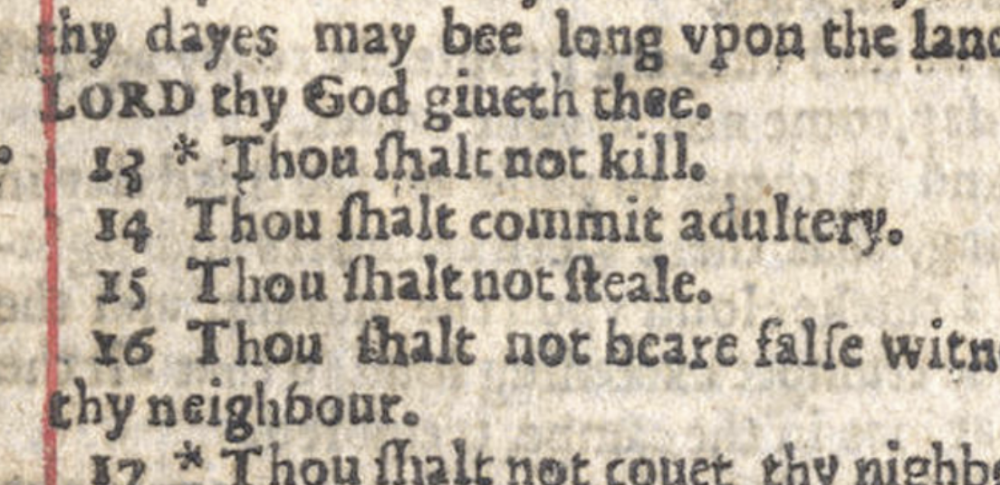
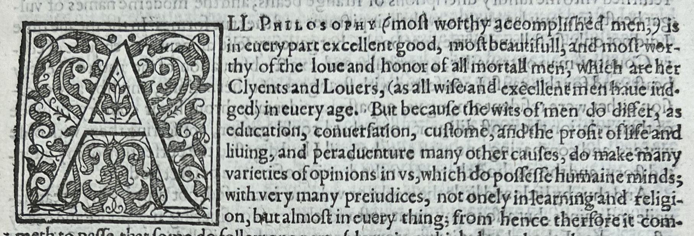
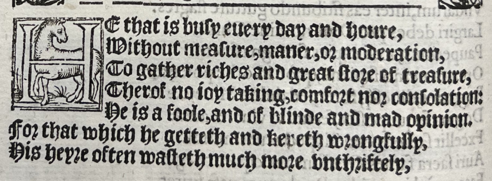
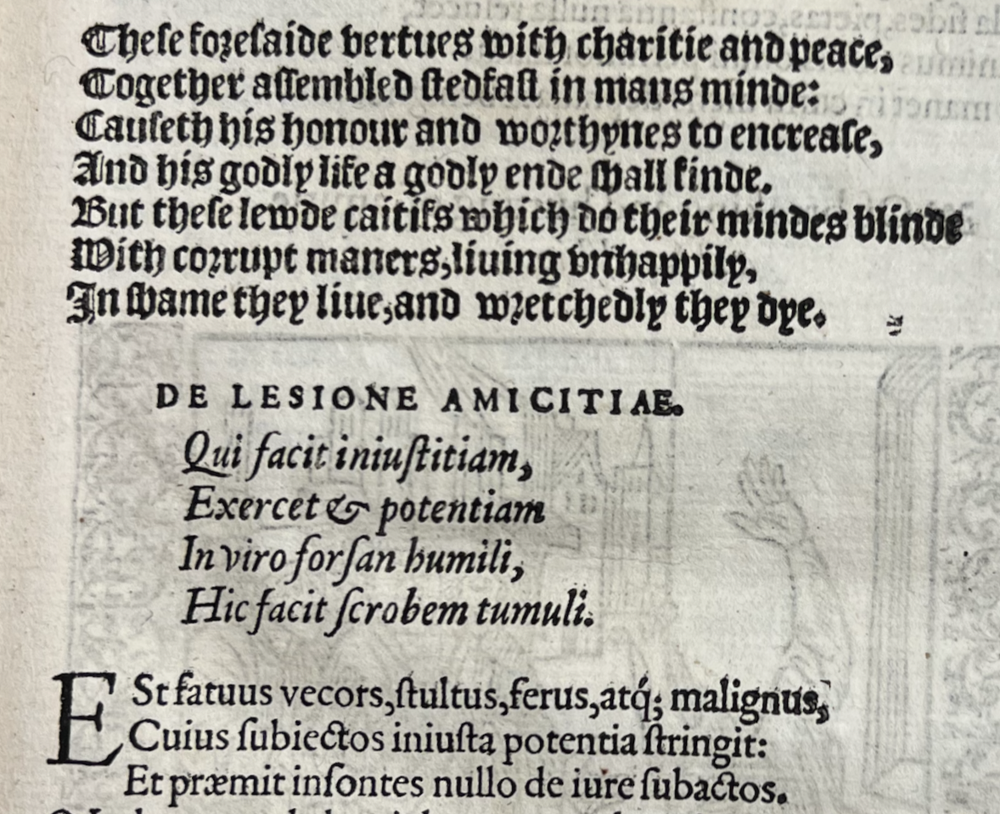
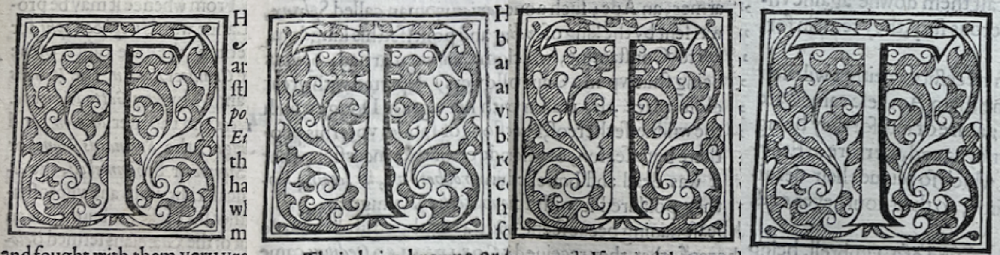
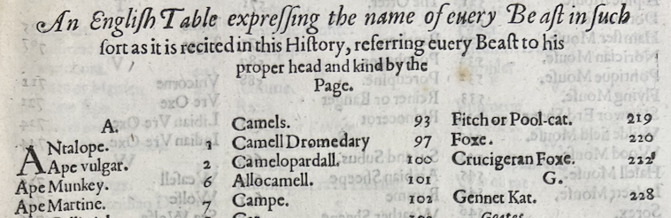

> This was a project for my honors colloquium class "Banned Books". Putting this together was fun and I visited UD's special collections to see some actual early print books.

<!-- # Intro -->

What turns a text into a book? A text is a series of verbal statements glued together with transitions and punctuation. Paratext is everything around the text on the page that affects the reading experience, and gives a text a chance to become a book. Some easy examples of paratext include title pages, fonts, and covers. Paratext elevates a text into a book-lifing a string of words into a literary experience. Early medieval books lacked most presentation and met readers' eyes in a near-paratext-less form.[@genette_paratexts_1997, pp. 3] Compare this to a modern book where every single part of the book and everything around the book is part of the experience: bookstores like Barnes and Noble boast coffee shops, book covers are meticulously designed to compliment the text, authors use software like scrivener and latex to format their book to tailor the experience, and the development of modern print technology lets authors put pictures of whatever wherever they want in their text to add to the experience. Paratext developed slowly over a centuries long time span, but the development of press technology catapulted paratext practices towards their modern state.

Paratext divides itself nicely into two broad categories: epitext and peritext. Epitext refers to everything outside the pages that affects how the reader interacts with the book or understands the book like author interviews or even just hearing about the book from other people. Literary awards (Nobel, Pulitzer, and Nebula, to name a few) would also serve as epitext along with the general historical context of the work. The other half of paratext, peritext, is what this work will focus on and refers to the paratext closest to the text and on the pages. Think of peritext like a Christmas gift's wrapping paper. What would a children's book be without illustrations?^[Answer: a very, very sad childrens book.] Consider a book with no headings and no empty lines, just words on every page. Peritext is how the author and publisher interact with the readers' experience. 

Peritext is almost perfectly causal: the author, printer, or scribe changes the manuscript or book in a way and their change influences the experience. It might seem unrealistic to paint a deterministic picture like this, but consider titles. A work like \textit{They Both Die at the End} by Adam Silvera would have a completely different reading experience if the title portrayed any other message. The power of headings trickles down the hierarchy into chapter titles, headings, and subheadings, too. John Green's first novel, \textit{Looking for Alaska}, labels each chapter with a distance between the chapter and some event, priming the reader for some sort of uber-climatic climax completely separating the 'before' from the 'after.' Crafting a specific experience is not unique to 21st century writers: renaissance book peddlers often slang small ephemeral prints.[@salzberg_selling_2011] The small ephemeral books paired with the epitext of the book slinger performing in the streets crafted a unique reading experience, especially when compared to the books kept in academic libraries and read by scholars. Furthermore, paratext does not only live in European texts, and even the first multi-color printed image, a decent landmark in the history of paratext, came from 14th century China.[@sullivan_arts_1984, pp. 203] All of this goes to say that paratext is inescapable and monumentally impacted by the press.

Though Elizabeth Eisenstein probably still rolls around in her grave whenever anyone dares to question the impact of the press, the invention and development of the press is a meaningful landmark in the history of paratext. Before Gutenberg worked his magic, manuscripts contained hand-made visual elements like color illuminations. Printed books, particularly those of early print, commonly used woodcut engravings or metal engravings to add visual elements. Engravers carved wood blocks or metal plates and then used them to print illustrations or decorations onto the pages of the book. Early European engravings lacked the intricate detail, personal touch, and color^[This, of course, only applies for early European print until color prints showed up in the form of chiaroscuro woodcuts after their 1508 invention by Lucas Cranach the Elder in Germany.] of illuminated manuscripts, but they still added interest and embellishment to the printed page.

Furthermore, the press's invention marks more than just the end of illuminations; it marks the (slow) start of the commodification of books. With the development of technology like the steam powered printing press books became more efficient and cheap to produce leading to the growth of the book market. Groups gathered in newly founded print shops and brought new marketing and manufacturing techniques to book production.[@eisenstein_printing_2012, pp. 22-23]. In these stores they most likely met a hefty crew of engravers, composers, and press operators collectively churning out printed materials. While this historical image would fall under epitext,^[figure out something interesting to say here] early print lent itself to small, consistent, wide-spread errors. Issues with books like the'wicked' bible, a bible that directed readers to commit adultery instead of not commit adultery (Figure 1),[@eisenstein_printing_2012, pp. 56] were present in every copy for each round of printing. For small errors in prints like these, products of one worker's small mistake, authors circulated errata sheets, pieces of paper detailing the mistakes in the text and the corrections.[@eisenstein_printing_2012, pp. 56--57] Sadly, errata sheets were not enough to keep readers of the 'wicked' bible from committing adultery, and their copies had to be recalled.^[Luckily around a dozen copies are still kicking it today in the special collections of universities like Oxford, Cambridge, Princeton, and Yale, as well as the New York Public Library's rare books collection.] 

{#fig-1}

An event like the 'wicked' bible's publication could not have happened through the process of scribes hand-writing a copy of another manuscript. If a scribe's hand slipped and he wrote the wrong word, or if his eyesight was poor and he read the copy wrong, they would only create one manuscript instructing the reader to commit adultery rather than an entire batch. Errata sheets for a hand-made manuscript would need to be uniquely made for each manuscript, which is why they only started shuffling around for printed materials. 

When looking at the impact of the press, examining the paratext the author had more direct control over, peritext, will be more rewarding and interesting. The first key factor the author had control of that this work will consider is the typeface. With the standardization of lettering of the press came different standards, most notably gothic and roman typefaces for early print.[@eisenstein_printing_2012, pp. 59] An author of a work of science, like Edward Topsell, might use a Roman typeface to give the work a more serious, academic feel (Figure 2).  On the other hand, a work of satire like Sebastian Brant's allegory of a dysfunctional ship that really talks about dysfunctional governments, \textit{The Ship of Fooles}, might use a gothic typeface to give the work a more whimsical, light-hearted feel (Figure 3).

{#fig-2}

{#fig-3}

{#fig-4}

It seems logical that the removal of handwritten words would also remove an element of paratext, and while that is true to some exteit it also opened up the door for the author and printer to work together to better. In a 1570 printing of \textit{The Ship of Fooles} by Sebastian Brant, the text is clearly divided into sections of gothic and roman typeface (Figure 4). The standardization of typeface gave authors and printers another degree of creative freedom to present the text in an even more encompassing manner. In a similar manner, because the engravings could be easily reused books could have the consistent initials, the big, decorative letters are the start of sections, throughout the work. Looking at the same 1570 printing of 'The Ship of Fooles,' the T initial is consistently reused throughout the work (Figure 5).

{#fig-5}

With standardization and consistency in mind, the press also affected the paratext of early scientific works, like 'The Historie of Foure-footed Beastes' by Edward Topsell, by allowing for a standard of spacing between lines and paragraphs. The standardization of spacing allowed for the author to separate sections of the text in a way that would be consistent throughout the work, i.e. consistent margins, and allowed for formal-looking tables to be included. In the same 1570 printing of 'The Ship of Fooles,' the author includes a printed table listing the names of four footed beastes (Figure 6). 

{#fig-6}

Even though reading 16th century English is a near herculean task, it is relatively clear the author split up the contents in these paragraphs differently for some sort of story telling reason (Figure 4). The storytelling strategy of separating sections of a text with typeface carried on since Brant's time. In her near canonical novel \textit{Parable of the Sower}, Octavia Butler puts verse in bold at the start of each chapter. The visual contrast between the boldface and the regular typeface lets her separate the verse from the chapter and, more importantly, make it stand out from the body of the chapter. In Butler's case, the development of the verse throughout her novel corresponds to a development of philosophy and religion gained from the experiences of the chapter beforehand. 

In a similar manner, because engravings could be reused, books could have consistent initials, the big, decorative letters at the start of sections throughout the work. Though, the printed works rarely had the same level of size choice as manuscripts at the time where scribes drew larger, more stunning letters to pair with more striking and important divisions in the text.[@carroll_pragmatics_2013, pp. 59] For something like a work of science,^[Admittedly, the history of four footed beasts is not a good example of a 'scientific' work since a decent amount of the four footed beasts are fictional, including the one on the title page.] the standardization gives the reader a sense of sophistication and order. On the other hand, the lack of standardization molds a feeling of secrecy and intimacy similar to reading someone's handwritten diary.

Though the font was standardized, early print was far from standardized in general. Looking at any of the pictures of the early printed works earlier in this work it is clear there is no standardization of spelling. The random almost humorous spelling found throughout the works pictured earlier seems like it might not even be consistent with itself. However, this small feature in the works does not destroy Elizabeth Eisenstein's arguments since spelling was also far from standardized in manuscripts.[@eisenstein_printing_2012, pp. 348] The varying spellings were more a feature of the late-manuscript-early-print time period^['the time period' is a very vague phrase to use, but it means the time before things like webster's dictionary (mid 18th century) or early style guides (chicago manual first published in early 20th century) guided authors and printers on how to spell or how to cite.] rather than a fault of early print itself.

Though this work has mainly focused on how paratext compliments the reading experience, paratext does more than help the reader interpret and interact with the story. How a book is decorated, both on the outside by bookbinders and the inside by engravers and printers, affects which types of people will buy and read them.[@carroll_pragmatics_2013, pp. 64] More sophisticated, intricate works lent themselves to more prestigious owners, and less sophisticated works, like street peddler prints, lent themselves to less prestigious readers. 

Even though paratext changed greatly from the advent of print, this practice still exists in modern print. There is an entire market for decorative books in the 21st century: books whose only purpose is to be a symbol of class and prestige. Additionally, plenty of classic novels exist in cloth bound editions with deckled edges, much fancier than their mass market paperback counterparts.

With the print-induced commercialization of books came the necessity for printer reputation. Though the \textit{literal} advertisements inside modern books did not appear in early printed works, early prints introduced another name to the title page: the printer. Early manuscripts were largely fueled by commission,[@ruokkeinen_material_2017, pp. 125] but with the switch to print and the birth of the print market^[see earlier remarks about the birth of the book market] printers were not able to wait around for customers to commission books for them since they needed to stock their shelves. Putting their name on the title page, larger than the author of the text in the case of \textit{The Historie of Foure-footed Beastes}, was a method of building a customer base by making sure the reader knew who printed the book.

<!-- # Conclusion -->

Exploring paratext reveals the layers that transform a text into a book, shaping the reading experience and engaging the reader in ways beyond the words on the page. From the historical roots of paratext to its evolution alongside printing technology, and printing technology’s landmark effect on paratext, this work delved into how elements like title pages, fonts, illustrations, and even errata sheets contribute to the literary encounter. The distinction between epitext and peritext elucidates the broader context surrounding a book and the elements directly influencing the reading process. Through epitext, encompassing author interviews, literary awards, and historical context, readers encounter a book's narrative before even turning its pages. Peritext, on the other hand, is the immediate environment of the text, akin to the wrapping paper of a gift, influencing the reader's journey within the book itself.

Printing technology not only revolutionized the dissemination of knowledge^[Sorry to all the Adrian Johns supporters who live to invalidate Eisenstein's career.] but also introduced new dimensions to paratext. Standardized typefaces, consistent spacing, and reusable engravings provided authors and printers with creative tools to enhance the presentation of their work.  Whether through the choice of typeface or the layout of illustrations, paratext became a means for authors and printers to craft specific reading experiences tailored to their narrative goals rather than leaving creative choices to a scribe who the author likely has no relation to. It also extends beyond aesthetics, playing a crucial role in shaping the book's reception and audience. The visual appeal of a book, both in its exterior design by bookbinders and interior embellishments by engravers, influences its perceived value and attracts diverse readerships.

Analyzing paratext offers an avenue for understanding the relationship between text, reader, and the broader culture. By examining case studies and examples the nuance of paratextual elements and their impact on the reading experience is unraveled, shedding light on the interplay between form and content in the world of books.
